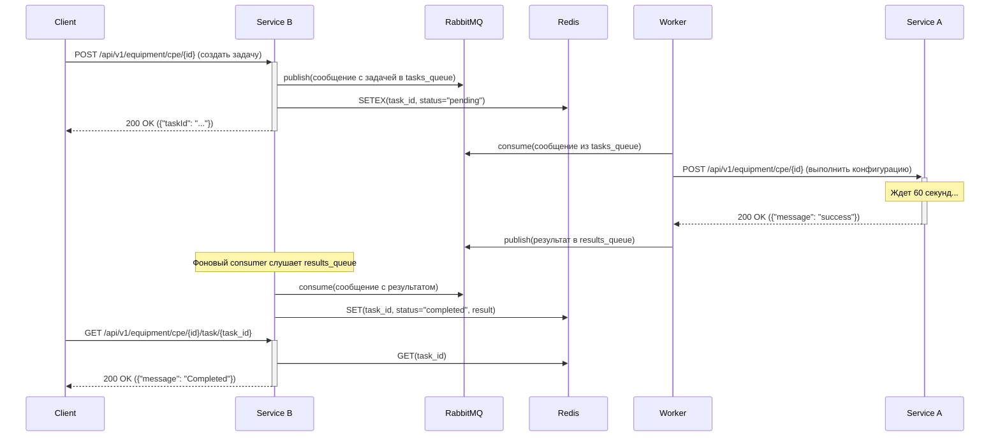

# Async Equipment Provisioning Service

## 📌 Описание

Реализация микросервисной архитектуры для асинхронной конфигурации оборудования через очередь сообщений.

Проект состоит из трёх компонентов:

- **Service B** — основной HTTP API, который создает задачи и отслеживает их статус;
- **Worker** — слушает очередь задач, вызывает внешний сервис и отправляет результат;
- **Service A (stub)** — заглушка внешнего конфигурационного сервиса, симулирующая ответ через 60 секунд;
- **Redis** — хранилище задач;
- **RabbitMQ** — брокер сообщений.

---
## Диаграмма взаимодействия

На диаграмме ниже показан полный жизненный цикл задачи от создания до проверки результата.



## Описание компонентов
*   **Service A**: Синхронный сервис-заглушка...
*   **Service B**: Основной асинхронный API...
*   **Worker**: Обработчик задач из очереди...
*   **RabbitMQ**: Брокер сообщений...
*   **Redis**: Хранилище временных статусов задач...


## Как запустить

```bash
1. git clone https://github.com/BurkovAleksandr/Rostelecom.git
2. cd Rostelecom
Сгенерируйте SSL-сертификаты:
3. cd service_b/cert
4. openssl req -x509 -newkey rsa:2048 -nodes   -keyout ./key.pem -out ./cert.pem -days 365

Запуск:
5. docker compose up --build
```
